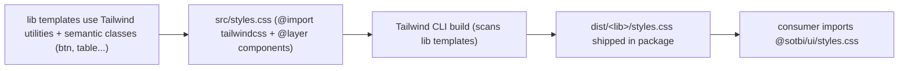

# Migrate Ui & UI-AG-GRID from Clarity to Tailwind CSS

## Goal

Remove all usage of `@clr/angular` and `@clr/ui` from `@sotbi/ui` and `@sotbi/ui-ag-grid`, and from [package.json](package.json), replacing Clarity with Tailwind CSS.

## Decisions (confirmed)

- Dates: Kendo `kendo-datepicker` (already used in [ui-ag-grid/src/lib/date-picker-editor.component.ts](ui-ag-grid/src/lib/date-picker-editor.component.ts)). Other inputs/select/checkbox: native HTML + Tailwind.
- Icons: inline SVG from Heroicons (replacing `clr-icon`).
- Delivery (recommended): each library ships a single compiled Tailwind CSS file; consumers import it instead of `@clr/ui`.

## Clarity usage found

Interactive `@clr/angular` components (need functional replacement):

- `payments-filter`: `clrForm`, `clr-select-container`/`clrSelect`, `clr-date-container`/`clrDate`/`clrDateChange`, `clr-row`/`clr-col-*` grid.
- `links`, `short-links`: `clr-input-container`/`clrInput`, `clr-icon` (pencil/check/trash/floppy).
- `filter-search`: `clr-checkbox-wrapper`/`clrCheckbox`, `clr-input-container`/`clrInput`, `clr-icon` (search).

Clarity CSS-only classes (`@clr/ui`, no `@clr/angular` import): `.btn*`, `.table`/`.table-compact`, `.clr-row`/`.clr-col-*`, `.clr-control-label`, `.clr-select-wrapper`, `.clr-input`, `.label`, `.is-error`/`.is-highlight`, `.spinner`, `.tooltip*`. Used across `links`, `short-links`, `collapsible-block`, `dialog-can-deactivate`, and ui-ag-grid (`status-bar`, `labels`, `button-actions`, `button-renderer`, `custom-header`, `right-side-bar`, `textarea-editor`, `post-addres-grid`).

Raw-HTML icon strings: `post-addres-grid.component.ts` cellRenderer returns `<clr-icon .../>`; `payment-form.component.ts` STYLE string has a `clr-icon{}` rule.

## Delivery architecture

## Steps

### 1. Tailwind setup (both libs)

- Add `tailwindcss` (v4) and `@tailwindcss/postcss` to devDependencies in [package.json](package.json).
- Create `ui/src/styles.css` and `ui-ag-grid/src/styles.css`:
  - `@import "tailwindcss";`
  - `@layer components { ... }` defining the retained class names (`.btn`, `.btn-sm`, `.btn-primary`, `.btn-outline`, `.btn-link`, `.btn-icon`, `.btn-secondary`, `.btn-block`, `.btn-warning-outline`, `.btn-red`, `.table`, `.table-compact`, `.label`, `.is-error`, `.is-highlight`, `.spinner`, form-control styles) via `@apply`, replicating the current Clarity look.
- Wire a Tailwind CLI build step into each library's build so `styles.css` is emitted into the package output (extra Nx target / `package.json` build script feeding ng-packagr assets), and expose it via the published `package.json` (`exports`) so consumers do `@import '@sotbi/ui/styles.css'` (replacing their `@clr/ui` import).

### 2. ui library component changes

- [ui/src/lib/payments-filter/payments-filter.component.html](ui/src/lib/payments-filter/payments-filter.component.html) + [.ts](ui/src/lib/payments-filter/payments-filter.component.ts): drop `ClarityModule`; replace `clr-select-container`/`clrSelect` with native `<select>`; replace both `clr-date-container`/`clrDate` with `kendo-datepicker` (import `DateInputsModule`); convert `clr-row`/`clr-col-*` to Tailwind grid/flex utilities; keep `FormsModule`/`NgSelectModule`.
- [ui/src/lib/links/links.component.html](ui/src/lib/links/links.component.html) + [.ts](ui/src/lib/links/links.component.ts): drop `ClarityModule`; `clr-input-container`/`clrInput` -> native `<input>`; `clr-icon` pencil/check/trash/floppy -> Heroicons inline SVG; `clr-select-wrapper` -> Tailwind.
- [ui/src/lib/short-links/short-links.component.html](ui/src/lib/short-links/short-links.component.html) + [.ts](ui/src/lib/short-links/short-links.component.ts) + [.scss](ui/src/lib/short-links/short-links.component.scss): same input + trash-icon replacement; replace `.clr-control-label` rule.
- [ui/src/lib/filter-search/filter-search.component.ts](ui/src/lib/filter-search/filter-search.component.ts) + [.scss](ui/src/lib/filter-search/filter-search.component.scss): drop `ClarityModule`; `clr-checkbox-wrapper`/`clrCheckbox` -> native checkbox; `clr-input-container`/`clrInput` -> native input; `clr-icon` search -> Heroicon; replace `.clr-form-control` rule.
- [ui/src/lib/payment-form/payment-form.component.ts](ui/src/lib/payment-form/payment-form.component.ts): remove the `clr-icon{}` rule from the STYLE string (template has no Clarity).
- [ui/src/lib/dialog-can-deactivate/dialog-can-deactivate.component.scss](ui/src/lib/dialog-can-deactivate/dialog-can-deactivate.component.scss): replace `clr-icon` selector with the new svg markup selector. `collapsible-block` and `dialog-can-deactivate` HTML keep `btn*` classes (now backed by our stylesheet).

### 3. ui-ag-grid changes

- [ui-ag-grid/src/lib/post-addres-grid.component.ts](ui-ag-grid/src/lib/post-addres-grid.component.ts): cellRenderer returns Heroicon inline SVG string instead of `<clr-icon shape=...>`.
- [ui-ag-grid/src/lib/status-bar.component.ts](ui-ag-grid/src/lib/status-bar.component.ts): replace `class="clr-input"` with our input class / Tailwind.
- `labels`, `button-actions`, `button-renderer`, `custom-header`, `right-side-bar`, `textarea-editor`, `checkbox-filter`: only CSS classes (`btn*`, `label`, `is-error`) — no code change beyond being covered by the new stylesheet (verify visual parity).

### 4. Remove Clarity wiring

- Remove `@clr/angular` and `@clr/ui` from dependencies in [package.json](package.json).
- Remove `@clr/angular` from peerDependencies in [ui/package.json](ui/package.json).
- Delete the Jest mock [ui/src/__mocks__/clr-angular.mock.ts](ui/src/__mocks__/clr-angular.mock.ts) and the `^@clr/angular$` `moduleNameMapper` entry in [ui/jest.config.ts](ui/jest.config.ts) and [ui-ag-grid/jest.config.ts](ui-ag-grid/jest.config.ts).
- Grep to confirm zero remaining `@clr/`, `clr-`, `clrInput`, `clrDate`, `ClarityModule` references.

### 5. Verify

- `nx run ui:lint --fix`, `nx run ui-ag-grid:lint --fix`
- `nx run ui:test`, `nx run ui-ag-grid:test` (update specs if any assert Clarity markup)
- `nx run ui:build`, `nx run ui-ag-grid:build` and confirm `styles.css` is emitted in each dist.

### 6. Storybook (ui & ui-ag-grid)

- Workspace: `@nx/storybook`, `storybook@10`, `@storybook/angular`, `@angular-devkit/build-angular`, `@storybook/addon-docs`.
- Per lib: `.storybook/main.ts`, `preview.ts`, `storybook-browser` target (loads compiled `styles.css`; ui-ag-grid also loads Kendo theme + `@sotbi/ui` styles).
- Nx targets: `storybook` (dev, ports 4400 / 4401), `build-storybook`, `static-storybook`; `dependsOn` `build-styles` (and `ui:build-styles` for ui-ag-grid).
- Starter stories: ui (`Footer`, `Breadcrumbs`, `FilterSearch`, `CollapsibleBlock`); ui-ag-grid (`LabelsAgGrid`, `ButtonRenderer`, `StatusBar/AddRows`).
- Commands: `yarn storybook:ui`, `yarn storybook:ui-ag-grid`, `yarn build-storybook`.

## Notes / risks

- The Tailwind v4 + ng-packagr asset pipeline (step 1) is the main setup risk; validate the emitted CSS before converting all templates.
- Kendo datepicker emits `Date`; map to existing `dateStartChange`/`dateEndChange` handlers (already `Date`-typed).
- Visual parity for `btn`/`table` styling depends on the `@layer components` definitions; tune to match prior Clarity appearance.
