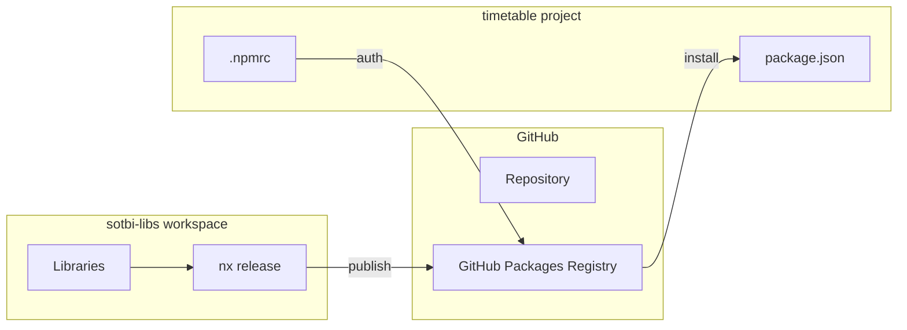

# Публикация приватных npm пакетов в GitHub Packages

## Текущее состояние

Workspace содержит 7 библиотек со scope `@sotbi`:

- `auth`, `data-access`, `models`, `state`, `ui`, `ui-ag-grid`, `utils`

Каждая библиотека уже имеет:

- Настроенный `nx-release-publish` target
- Конфигурацию версионирования через git-tag

## Архитектура решения



## Изменения

### 1. Конфигурация Nx Release в [nx.json](nx.json)

Добавить секцию `release` для настройки группы пакетов и GitHub Packages registry:

```json
{
  "release": {
    "projects": ["auth", "data-access", "models", "state", "ui", "ui-ag-grid", "utils"],
    "projectsRelationship": "independent",
    "changelog": {
      "workspaceChangelog": false,
      "projectChangelogs": {
        "createRelease": "github"
      }
    },
    "version": {
      "preVersionCommand": "nx run-many -t build",
      "generatorOptions": {
        "currentVersionResolver": "git-tag",
        "fallbackCurrentVersionResolver": "disk"
      }
    }
  }
}
```

### 2. Обновление package.json библиотек

Добавить `publishConfig` с registry и `private: false` в каждую библиотеку. Пример для [auth/package.json](auth/package.json):

```json
{
  "name": "@sotbi/auth",
  "publishConfig": {
    "registry": "https://npm.pkg.github.com",
    "access": "restricted"
  }
}
```

**Файлы для изменения:**

- `auth/package.json`
- `data-access/package.json`
- `models/package.json`
- `state/package.json`
- `ui/package.json`
- `ui-ag-grid/package.json`
- `utils/package.json`

### 3. Создание `.npmrc` в workspace root

```
@sotbi:registry=https://npm.pkg.github.com
//npm.pkg.github.com/:_authToken=${GITHUB_TOKEN}
```

### 4. Добавление скриптов в [package.json](package.json)

```json
{
  "scripts": {
    "release": "nx release",
    "release:version": "nx release version",
    "release:publish": "nx release publish"
  }
}
```

### 5. CI/CD workflow для автоматической публикации

Создать [.github/workflows/publish.yml](.github/workflows/publish.yml):

```yaml
name: Publish Packages
on:
  push:
    tags:
      - '*@*'
jobs:
  publish:
    runs-on: ubuntu-latest
    permissions:
      contents: read
      packages: write
    steps:
      - uses: actions/checkout@v4
      - uses: actions/setup-node@v4
        with:
          node-version: 20
          registry-url: https://npm.pkg.github.com
      - run: yarn install --frozen-lockfile
      - run: nx run-many -t build
      - run: nx release publish
        env:
          NODE_AUTH_TOKEN: ${{ secrets.GITHUB_TOKEN }}
```

## Настройка в проекте timetable

Для использования пакетов в `timetable` проекте добавить `.npmrc`:

```
@sotbi:registry=https://npm.pkg.github.com
//npm.pkg.github.com/:_authToken=${GITHUB_TOKEN}
```

И установить пакеты:

```bash
yarn add @sotbi/auth @sotbi/models @sotbi/utils
```

## Процесс публикации

1. **Локально (с GITHUB_TOKEN):**

   ```bash
   export GITHUB_TOKEN=ghp_xxx
   nx release --first-release  # первый релиз
   nx release                  # последующие релизы
   ```

2. **Через CI/CD:** автоматически при создании git tag
